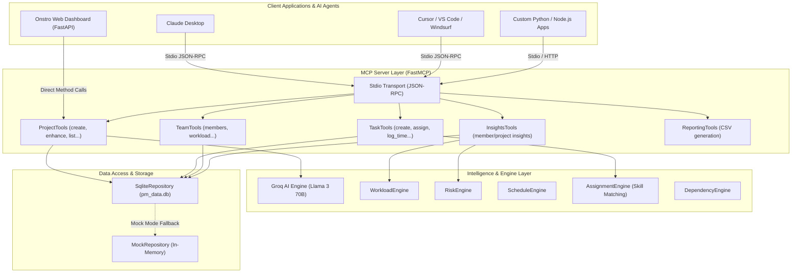

# Onstro MCP Architecture & Integration Guide

## 1. Overview & System Architecture

Onstro MCP is a model-driven Project Management Model Context Protocol (MCP) server built with **FastMCP** and Python. It empowers AI agents (such as Claude, Cursor, Windsurf, or custom LLM applications) to manage projects, tasks, team workloads, time logs, and AI project enhancements directly through standardized MCP tools.



---

## 2. Core Architectural Layers

### A. MCP Tool Layer (`src/pm_mcp/tools/`)
All capabilities are exposed as registered `@mcp.tool` functions:
- **`enhance_project`**: AI tool that refines project titles and expands descriptions into full technical specifications using Groq LLM.
- **`create_project` / `list_projects` / `get_project` / `update_project` / `delete_project`**: Full project lifecycle management.
- **`log_time` / `get_time_logs`**: Log real-life work time (hours, descriptions) per task and member.
- **`get_member_insights` / `get_project_insights`**: Computes completion rates, active work hours, overdue flags, and underperforming flags.
- **`auto_assign_project` / `assign_task`**: Smart AI assignment based on member workload and skill matrices.

### B. Business & Intelligence Engines (`src/pm_mcp/engines/` & `src/pm_mcp/ai/`)
- **Groq AI Client (`groq_client.py`)**: Asynchronous client calling Llama 3 models on Groq for ultra-fast text and JSON generation.
- **Workload & Skill Matching Engine**: Analyzes task complexity vs member skill vectors to recommend optimal assignees.
- **Risk & Schedule Engine**: Identifies bottleneck tasks, blocked dependencies, and critical path deadlines.

### C. Data Abstraction Layer (`src/pm_mcp/repositories/`)
- **`SqliteRepository`**: Local SQLite database storage in `pm_data.db`. Auto-migrates tables (`projects`, `tasks`, `team_members`, `time_logs`).
- **`MockRepository`**: Zero-dependency mock storage for unit testing and instant demonstration mode without local file side-effects.

---

## 3. How to Connect Onstro MCP to Other Projects

### Method 1: Connecting to Claude Desktop App

Add the server entry to your `claude_desktop_config.json` (located at `%APPDATA%\Claude\claude_desktop_config.json` on Windows or `~/Library/Application Support/Claude/claude_desktop_config.json` on macOS):

```json
{
  "mcpServers": {
    "onstro-pm": {
      "command": "py",
      "args": [
        "-m",
        "pm_mcp.server"
      ],
      "cwd": "D:/Aditya/Internship/Onstro MCP/Onstro-MCP",
      "env": {
        "PYTHONPATH": "src",
        "GROQ_API_KEY": "your_groq_api_key_here",
        "MOCK_MODE": "false"
      }
    }
  }
}
```

---

### Method 2: Connecting to Cursor / Windsurf / VS Code (via Stdio)

In your editor's MCP settings (`.cursor/mcp.json` or Editor Settings -> MCP Servers):

```json
{
  "mcpServers": {
    "onstro-pm": {
      "command": "python",
      "args": ["-m", "pm_mcp.server"],
      "cwd": "path/to/Onstro-MCP",
      "env": {
        "PYTHONPATH": "src",
        "GROQ_API_KEY": "your_groq_api_key_here"
      }
    }
  }
}
```

Once connected, any prompt in Cursor or Claude like *"Create a new project for AI chatbot and enhance it"* or *"Log 4 hours for member 2 on task 1"* will trigger Onstro MCP tools automatically.

---

### Method 3: Connecting from Custom Python Projects (Using `mcp` Python Client)

You can launch and interact with Onstro MCP programmatically in any Python application:

```python
import asyncio
from mcp.client.stdio import stdio_client, StdioServerParameters
from mcp.client.session import ClientSession

async def main():
    server_params = StdioServerParameters(
        command="python",
        args=["-m", "pm_mcp.server"],
        env={"PYTHONPATH": "src", "GROQ_API_KEY": "your_groq_api_key"}
    )
    
    async with stdio_client(server_params) as (read, write):
        async with ClientSession(read, write) as session:
            await session.initialize()
            
            # List available tools
            tools = await session.list_tools()
            print("Available Tools:", [t.name for t in tools.tools])
            
            # Call enhance_project tool
            result = await session.call_tool("enhance_project", arguments={
                "title": "E-commerce Payment Gateway",
                "description": "Integration with Stripe and PayPal"
            })
            print("Enhanced Project:", result.content)

asyncio.run(main())
```

---

### Method 4: Connecting Web Services / Node.js Apps (via HTTP / FastAPI Server)

If another project is written in Node.js, C#, Go, or React, you can run `ui_server.py`:

```bash
python ui_server.py
```

This exposes RESTful HTTP API endpoints on `http://localhost:8000`:
- `POST /api/ai/enhance-project` -> Calls MCP `enhance_project` tool
- `POST /api/tasks/{task_id}/log-time` -> Calls MCP `log_time` tool
- `GET /api/insights/member/{member_id}` -> Calls MCP `get_member_insights` tool
- `GET /api/reports/team/csv` -> Calls MCP CSV generator
