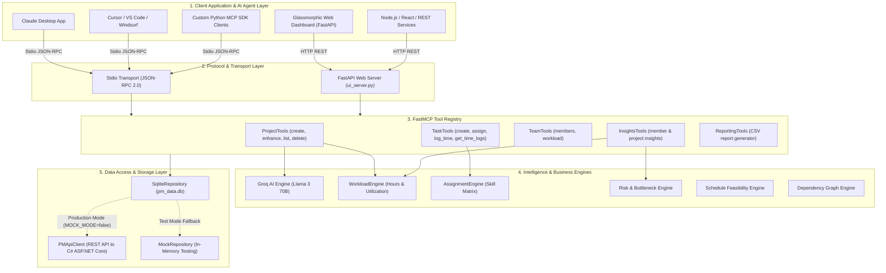

# Onstro MCP Architecture & Multi-Application Integration Guide

## 1. Overview & System Architecture

Onstro MCP is a model-driven Project Management Model Context Protocol (MCP) server built with **FastMCP** and Python 3.12. It enables AI agents (Claude, Cursor, Windsurf, custom Python/Node.js LLM applications) to manage project lifecycles, workload-balanced task allocations, real-life time tracking, and risk analytics through standardized MCP tools.



---

## 2. Core Functional Capabilities

1. **🚀 AI Project Specification (`enhance_project`)**:
   - Refines titles and expands descriptions into full technical specifications using Groq Llama 3 70B.
2. **⚖️ Workload-Balanced Task Allocation (`create_project` & `auto_assign_project`)**:
   - Auto-generates 4-5 initial actionable breakdown tasks upon project creation.
   - Assigns tasks to team members based on their current total work hours to balance workload evenly.
3. **⏱️ Real-Life Work Time Tracking (`log_time` & `get_time_logs`)**:
   - Logs actual hours worked per task and member with accomplishment notes into `time_logs`.
4. **⚠️ Performance Monitoring & Flagging (`get_member_insights`)**:
   - Automatically flags members as `FLAGGED` if completion rate falls below 40% with overdue tasks or if workload capacity is exceeded.
5. **📥 Automated CSV Reporting (`generate_csv_report`)**:
   - Exports team and project analytics into downloadable CSV reports.

---

## 3. Process of Using Onstro MCP in Other Applications

### Option A: Using Onstro MCP in AI IDEs (Claude Desktop, Cursor, Windsurf, VS Code)

In your IDE or Claude Desktop configuration (`claude_desktop_config.json` or `.cursor/mcp.json`):

```json
{
  "mcpServers": {
    "onstro-pm": {
      "command": "python",
      "args": [
        "-m",
        "pm_mcp.server"
      ],
      "cwd": "D:/Aditya/Internship/Onstro MCP/Onstro-MCP",
      "env": {
        "PYTHONPATH": "src",
        "GROQ_API_KEY": "your_groq_api_key_here",
        "MOCK_MODE": "false"
      }
    }
  }
}
```

Once added, prompt your AI assistant directly:
- *"Create a new project for E-commerce Mobile App and allocate tasks."*
- *"Log 3.5 hours for team member 2 on task 1 with notes 'Built authentication API'."*

---

### Option B: Using Onstro MCP in Python Applications (Official `mcp` SDK)

```python
import asyncio
from mcp.client.stdio import stdio_client, StdioServerParameters
from mcp.client.session import ClientSession

async def main():
    server_params = StdioServerParameters(
        command="python",
        args=["-m", "pm_mcp.server"],
        cwd="D:/Aditya/Internship/Onstro MCP/Onstro-MCP",
        env={
            "PYTHONPATH": "src",
            "GROQ_API_KEY": "your_groq_api_key_here",
            "MOCK_MODE": "false"
        }
    )

    async with stdio_client(server_params) as (read, write):
        async with ClientSession(read, write) as session:
            await session.initialize()

            # 1. Call enhance_project tool
            enhanced = await session.call_tool("enhance_project", arguments={
                "title": "Inventory System",
                "description": "Barcode scanning and real-time stock alerts"
            })
            print("Enhanced Project:", enhanced.content)

            # 2. Create project with automatic workload-balanced tasks
            project = await session.call_tool("create_project", arguments={
                "name": "Inventory System",
                "priority": "HIGH"
            })
            print("Created Project & Tasks:", project.content)

            # 3. Log work time
            time_log = await session.call_tool("log_time", arguments={
                "task_id": 1,
                "member_id": 2,
                "hours_logged": 4.0,
                "description": "Implemented barcode scanner API"
            })
            print("Time Logged:", time_log.content)

asyncio.run(main())
```

---

### Option C: Using Onstro MCP in Web Applications (Node.js / React / Next.js / REST)

Run the FastAPI HTTP server:
```bash
python ui_server.py
```

Endpoints available on `http://localhost:8000`:

| Functionality | Endpoint | Request Payload |
| :--- | :--- | :--- |
| **Enhance Project** | `POST /api/ai/enhance-project` | `{"title": "...", "description": "..."}` |
| **Create Project & Auto-Allocate Tasks** | `POST /api/projects/create` | `{"title": "...", "description": "...", "priority": "HIGH"}` |
| **Log Work Time** | `POST /api/tasks/{task_id}/log-time` | `{"member_id": 1, "hours_logged": 3.5, "description": "..."}` |
| **Member Dashboard & Flagging** | `GET /api/insights/member/{member_id}` | None |
| **Download CSV Report** | `GET /api/reports/team/csv` | Download file attachment |

---

### Option D: Connecting to ASP.NET Core C# Backend (Production Mode)

In `.env`:
```env
MOCK_MODE=false
PM_API_BASE_URL=http://your-csharp-backend:5000/api/v1
PM_API_KEY=your_api_key
PM_TENANT_ID=your_tenant_uuid
PM_APP_ID=your_app_uuid
```

All MCP tool calls will transmit `X-TenantId` and `X-AppId` headers directly to your production C# API backend endpoints.
